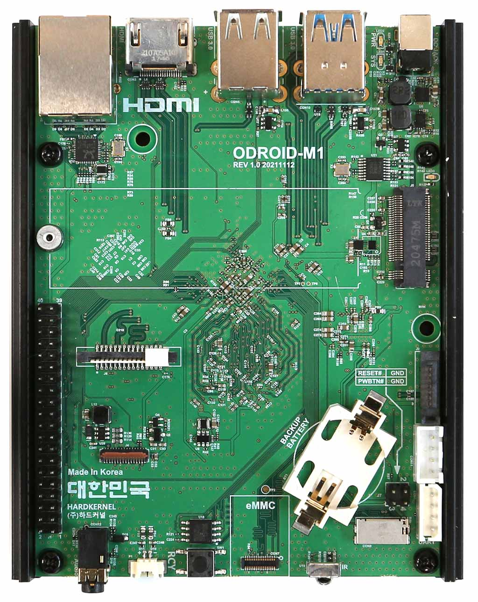

# Hardware

## Arm64
Why Arm?

As the big tech companies mature, market expansion begins to slow and there is a natural tendency to vertically integrate to continue growing. Cloud providers, such as AWS, Google and Microsoft as well as hardware providers like Apple all see opportunity to vertically integrate by making their own silicon. The downside of creating custom silicon is the integration of that silicon into the existing software ecosystem. I believe it would be reasonably hard to run a modern webapplication of any substaintial size on PowerPC for example. ARM provides a standard (instruction set) that allows companies to work toward a common interface. They are therefore not starting from scratch and the existing software communities can immediately adopt their new silicon (it usually is not so simple in practice however).

Although from a pure FOSS perspective, something like RISC-V, which is completely free and open source, is likely more interesting; at the time of writing, ARM has a bigger market share and is more likely to be used in production in the near term.

The main motivation for me was to see how difficult cross compiling software for ARM would be. Not necessarily compiling any individual package, but setting up a psudo-production environment based around ARM. A typical web application has hundreds to thousands of dependencies that we do not think about because package managers install them for us. It is not until you try to run the entire application end-to-end in a different environment do you realize one or more of them does not work on the target architecture.

## Odroid M1

### Desired Features:
M.2 Slot - I wanted to be able to have a few gig/terabytes of storage for flexibility. Perhaps to create an object store or other larger.
Memory - 8Gb of memory was desirable to support multiple containers running at the same time on the same node.

### Compromise:
CPU - Odroid-M1 is quite slow, it's RK3568B2 (Arm Cortex-A55) is slower than many newer SOC. 

